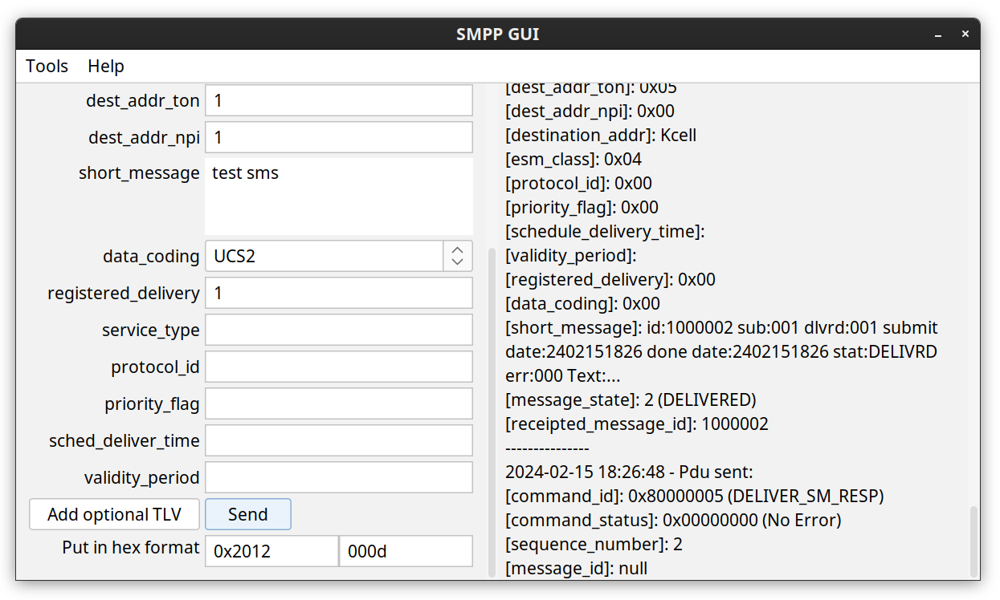

### smppgui

Simple SMPP GUI client written in java. No external dependencies. Works on Linux and Windows (should work on MacOS, not tested).

### Usage

You will need java 11 or higher preinstalled on your machine.

1. Download smppgui.jar from [https://github.com/ukarim/smppgui/releases](https://github.com/ukarim/smppgui/releases)
or build it manually using gradle: `gradle build`

2. Launch smppgui using following command: `java -jar smppgui.jar`

### Screenshot

### Build custom java runtime with smppgui

1. Build custom java runtime `gradle jlink`
2. Launch smppgui using the generated bash script: `./smppgui/bin/smppgui`
3. Finally, archive the generated _smppgui_ directory and distribute it. Thus, end users do not need to pre-install java on their computers.
